---
## Front matter
lang: ru-RU
title: Лабораторная работа №1
author: |
	Ефремова Ангелина Романовна - студентка группы НКНбд-01-18
date: 15.09.2021

## Formatting
toc: false
slide_level: 2
theme: metropolis
header-includes: 
 - \metroset{progressbar=frametitle,sectionpage=progressbar,numbering=fraction}
 - '\makeatletter'
 - '\beamer@ignorenonframefalse'
 - '\makeatother'
aspectratio: 43
section-titles: true
---

## Тема лабораторной работы

Установка и конфигурация операционной системы на виртуальную машину

## Зачем выполнять лабораторную работу?

- В процессе учебы и работы нередки случаи необходимости использования виртуальных машин. Лабораторная работа обучает всем базовым навыкам работы с виртуальными машинами
- Важно уметь конфигурировать и настраивать виртуальные машины самостоятельно, чтобы в будущем не тратить уйму времени на гугление каждого шага
- Развивает софт-скиллы, такие как аналитическое мышление и навык искать ошибки и исправлять их

## Цель выполнения лабораторной работы

Приобретение практических навыков установки операционной системы на виртуальную машину, настройки минимально необходимых для дальнейшей работы сервисов.

## Задачи выолнения работы

1. Установка VirtualBox 
2. Установка на виртуальную машину VirtualBox операционной системы Linux, дистрибутив Centos
3. Создание, запуск и конфигурация виртуальной машины Base
4. Создание виртуальной машины Host2 на основе созданной виртуальной машины Base

# Краткий процесс выполнения лабораторной работы

## 1 шаг

Создала новую виртуальную машину. Для этого в VirtualBox выбрала "Машина" - "Создать" (рис -@fig:001).

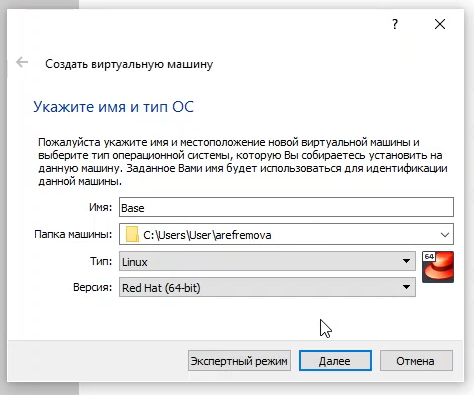{ #fig:001 width=60% }

## 2 шаг

Добавлю новый привод оптических дисков и выберу образ CentOS-6.6-i386-bin-DVD1.iso (рис -@fig:002).

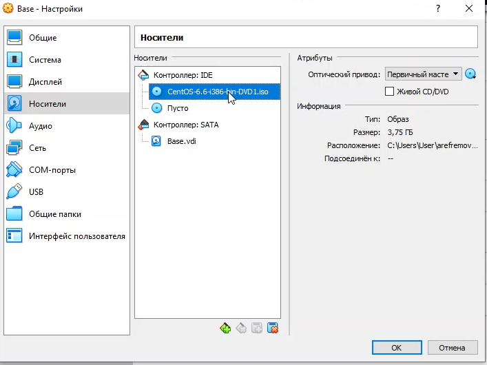{ #fig:002 width=70% }

## 3 шаг

Завершаю установку операционной системы (рис -@fig:003) и перезагружаю её.

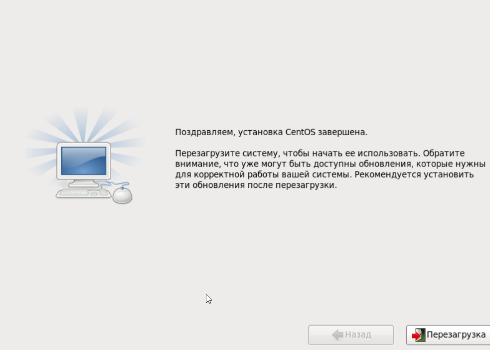{ #fig:003 width=70% }

## 4 шаг

Подключилась к виртуальной машине с помощью созданной учётной записи и ввела пароль (рис -@fig:004).

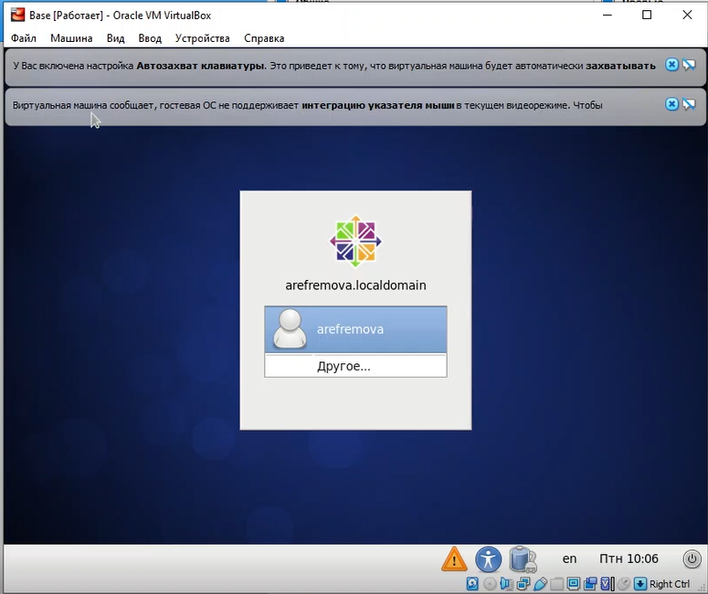{ #fig:004 width=60% }

## 5 шаг

После установки необходимых программ завершаю работу виртуальной машины. Освободила и изменила «Base.dvi» (рис -@fig:005, рис -@fig:006).

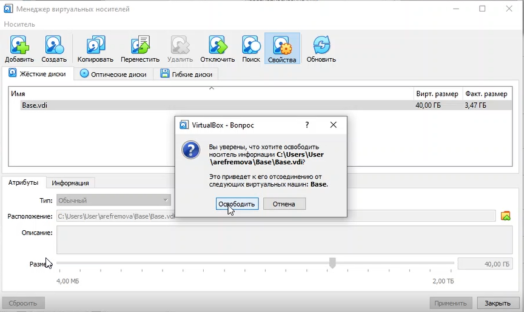{ #fig:005 width=70% }

## 

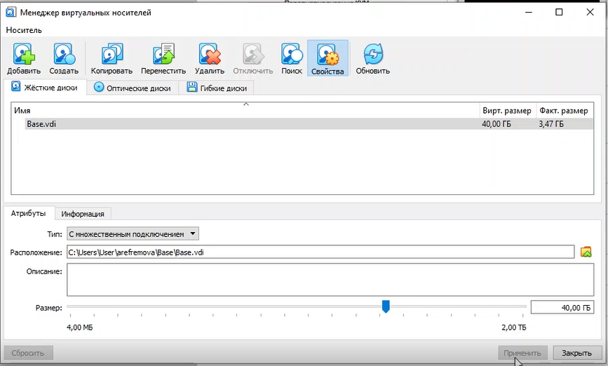{ #fig:006 width=70% }

## 6 шаг

Теперь на основе виртуальной машины Base создам машину Host2 (рис -@fig:007, рис -@fig:008).

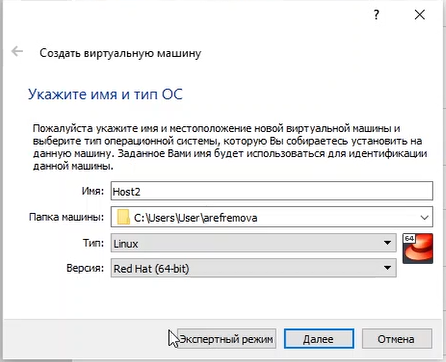{ #fig:007 width=60% }

## 

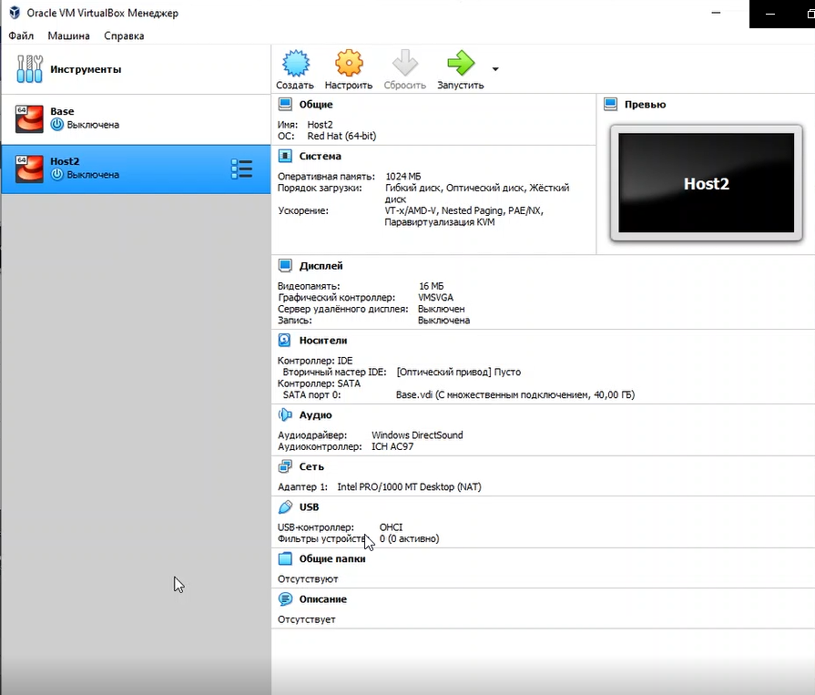{ #fig:008 width=70% }

# Результаты выполнения лабораторной работы

##

Создан новый каталог на диске С с моим именем пользователя arefremova (рис -@fig:009).

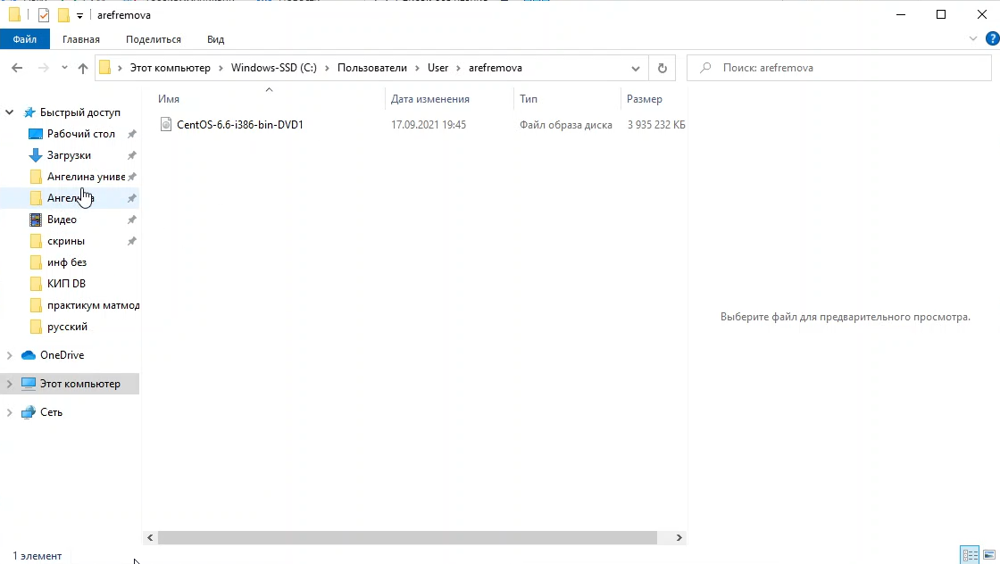{ #fig:009 width=70% }

##

Создана новая виртуальная машина Base (рис -@fig:010)

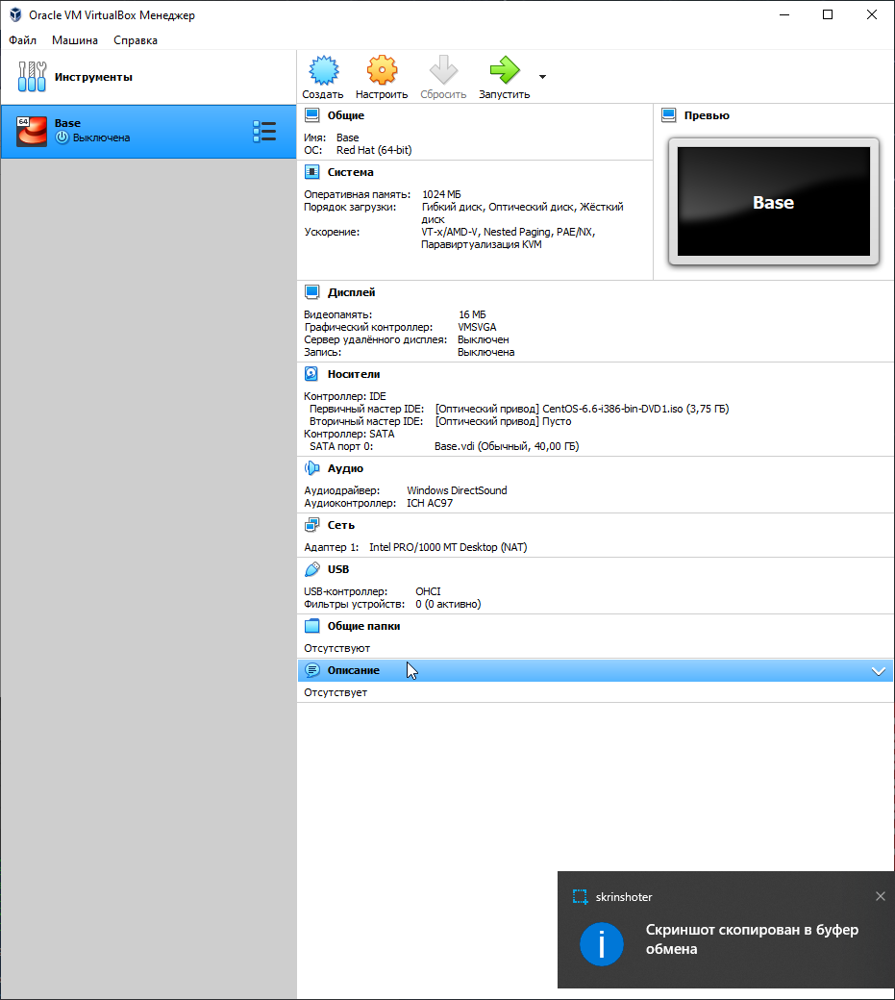{ #fig:010 width=50% }

##

Установлена и сконфигурирована виртуальная машина Base (рис -@fig:011, рис -@fig:012)

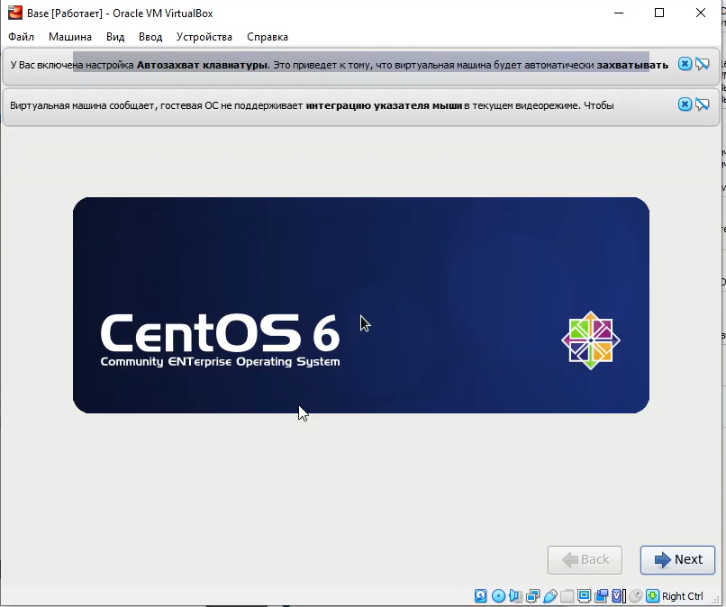{ #fig:011 width=70% }

## 

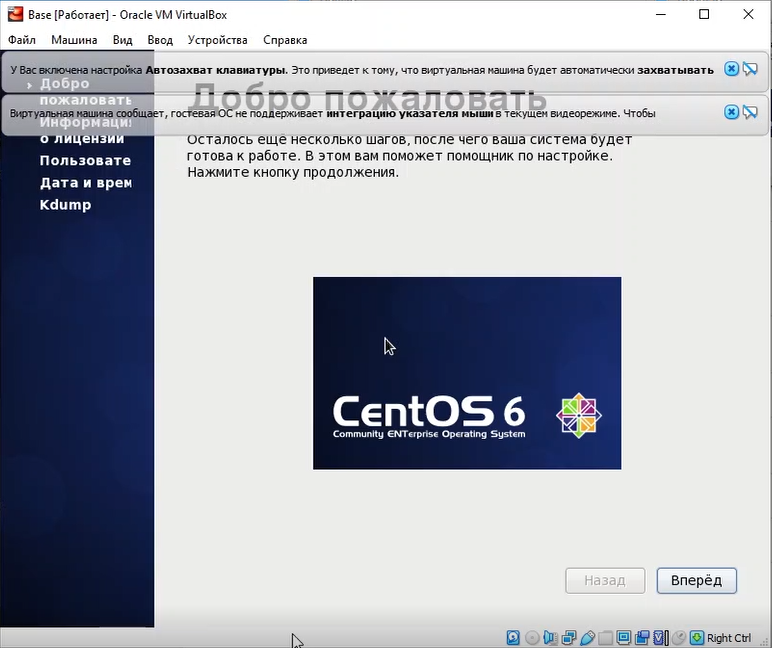{ #fig:012 width=70% }

##

Совершено подключение к виртуальной машине (рис -@fig:013)

{ #fig:013 width=70% }

##

Создана машина Host2 на основе виртуальной машины Base (рис -@fig:014)

{ #fig:014 width=70% }

## Выводы

В процессе выполнения лабораторной работы 1 я приобрела навыки установки операционной системы на виртуальную машину, настройки минимально необходимых для дальнейшей работы сервисов.