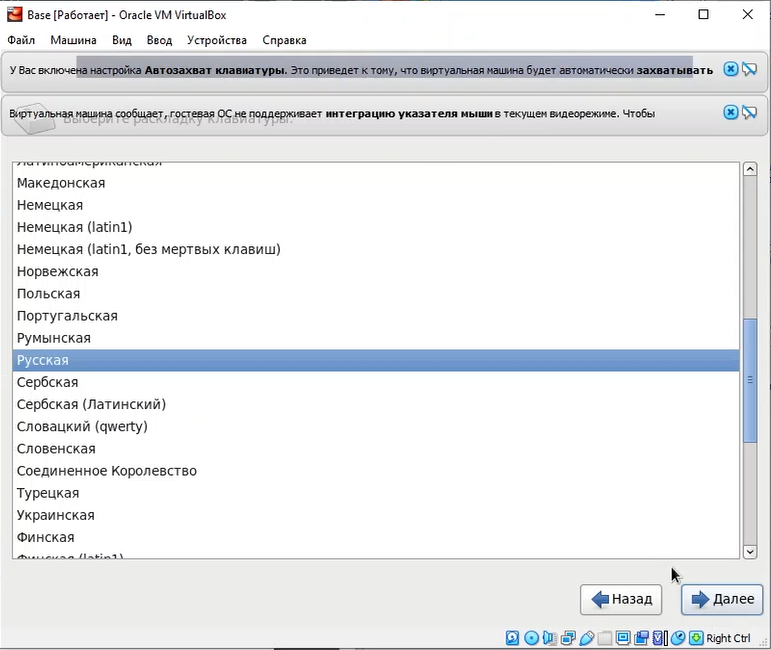
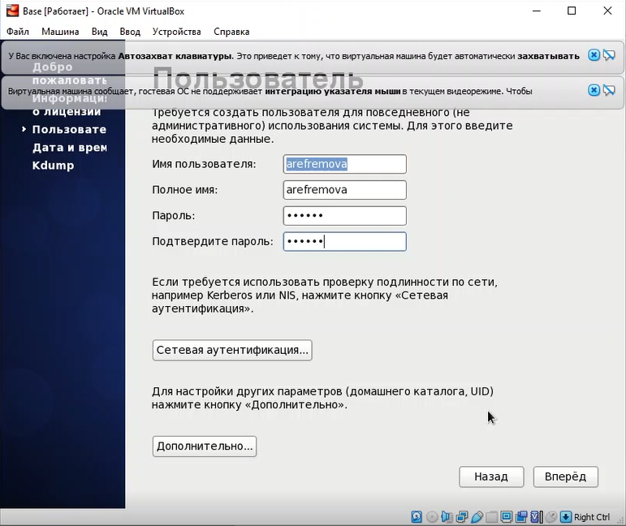

---
# Front matter
lang: ru-RU
title: "Лабораторная работа №1"
subtitle: "Установка и конфигурация операционной системы на виртуальную машину"
author: "Ефремова Ангелина Романовна"

# Formatting
toc-title: "Содержание"
toc: true # Table of contents
toc_depth: 2
lof: true # List of figures
lot: true # List of tables
fontsize: 12pt
linestretch: 1.5
papersize: a4paper
documentclass: scrreprt
polyglossia-lang: russian
polyglossia-otherlangs: english
mainfont: PT Serif
romanfont: PT Serif
sansfont: PT Sans
monofont: PT Mono
mainfontoptions: Ligatures=TeX
romanfontoptions: Ligatures=TeX
sansfontoptions: Ligatures=TeX,Scale=MatchLowercase
monofontoptions: Scale=MatchLowercase
indent: true
pdf-engine: lualatex
header-includes:
  - \linepenalty=10 # the penalty added to the badness of each line within a paragraph (no associated penalty node) Increasing the value makes tex try to have fewer lines in the paragraph.
  - \interlinepenalty=0 # value of the penalty (node) added after each line of a paragraph.
  - \hyphenpenalty=50 # the penalty for line breaking at an automatically inserted hyphen
  - \exhyphenpenalty=50 # the penalty for line breaking at an explicit hyphen
  - \binoppenalty=700 # the penalty for breaking a line at a binary operator
  - \relpenalty=500 # the penalty for breaking a line at a relation
  - \clubpenalty=150 # extra penalty for breaking after first line of a paragraph
  - \widowpenalty=150 # extra penalty for breaking before last line of a paragraph
  - \displaywidowpenalty=50 # extra penalty for breaking before last line before a display math
  - \brokenpenalty=100 # extra penalty for page breaking after a hyphenated line
  - \predisplaypenalty=10000 # penalty for breaking before a display
  - \postdisplaypenalty=0 # penalty for breaking after a display
  - \floatingpenalty = 20000 # penalty for splitting an insertion (can only be split footnote in standard LaTeX)
  - \raggedbottom # or \flushbottom
  - \usepackage{float} # keep figures where there are in the text
  - \floatplacement{figure}{H} # keep figures where there are in the text
---

# Цель работы

Приобретение практических навыков установки операционной системы на виртуальную машину, настройки минимально необходимых для дальнейшей работы сервисов.

# Задание

1. Установка VirtualBox 
2. Установка на виртуальную машину VirtualBox операционной системы Linux, дистрибутив Centos
3. Создание, запуск и конфигурация виртуальной машины Base
4. Создание виртуальной машины Host2 на основе созданной виртуальной машины Base

# Выполнение лабораторной работы

1. Я создала на своем ноутбуке новый каталог на диске С с моим именем пользователя arefremova и загрузила в него образ виртуальной машины CentOS-6.6-i386-bin-DVD1.iso (рис -@fig:001).

{ #fig:001 width=70% }

Запустила виртуальную машину, введя VirtualBox в командной строке (рис -@fig:002).

{ #fig:002 width=70% }

Проверила в свойствах VirtualBox месторасположение каталога для виртуальных машин. Для этого в VirtualBox выбрала "Файл", затем "Свойства", зашла во вкладку "Общие". В поле "Папка для машин" должен стоять путь к недавносозданному каталогу с моим именем. И все верно - путь стоит к нужной мне папке (рис -@fig:003).

{ #fig:003 width=70% }

Создала новую виртуальную машину. Для этого в VirtualBox выбрала "Машина" - "Создать". Указала имя виртуальной машины — Base, тип операционной системы — Linux, RedHat (рис -@fig:004).

{ #fig:004 width=70% }

Указала размер основной памяти виртуальной машины — 1024 МБ (рис -@fig:005).

{ #fig:005 width=70% }

Задала конфигурацию жёсткого диска — загрузочный (рис -@fig:006), VDI (BirtualBox Disk Image) (рис -@fig:007), динамический виртуальный диск (рис -@fig:008).

{ #fig:006 width=70% }

{ #fig:007 width=70% }

{ #fig:008 width=70% }

Задам размер диска — 40 ГБ, его расположение — в данном случае в папке Base в моем созданном каталоге (рис -@fig:009).

{ #fig:009 width=70% }

2. Выделяю в окне менеджера VirtualBox виртуальную машину Base, и открываю окно "Свойства". Проверю, что папка для снимков виртуальной машины Base имеет путь к /Base/Snapshots в моем созданном каталоге. Для этого выбираю в VirtualBox "Свойства" виртуальной машины Base, "Общие", вкладка "Дополнительно". Все в порядке, путь верный (рис -@fig:010).

{ #fig:010 width=70% }

Выберу в VirtualBox "Свойства" - "Носители виртуальной машины" (рис -@fig:011).

{ #fig:011 width=70% }

Добавлю новый привод оптических дисков и выберу образ CentOS-6.6-i386-bin-DVD1.iso (рис -@fig:012).

{ #fig:012 width=70% }

3. Запускаю виртуальную машину Base, выберу установку системы на жёсткий диск (рис -@fig:013).

{ #fig:013 width=70% }

Устанавливаю русский язык для интерфейса (рис -@fig:014) и раскладки клавиатуры (рис -@fig:015).

{ #fig:014 width=70% }

{ #fig:015 width=70% }

Указываю "Стандартные накопители" для установки ОС (рис -@fig:016).

{ #fig:016 width=70% }

В окне конфигурации жёсткого диска выбираю "Да, удалить данные" (рис -@fig:017).

{ #fig:017 width=70% }

В качестве имени машины указываю «arefremova.localdomain» (рис -@fig:018).

{ #fig:018 width=70% }

Указываю часовой пояс «Москва» (рис -@fig:019).

{ #fig:019 width=70% }

Устанавливаю пароль для root (рис -@fig:020).

{ #fig:020 width=70% }

При конфигурировании размера жёсткого диска указываю «Всё пространство» (рис -@fig:021).

{ #fig:021 width=70% }

Выбираю вариант стандартной установки CentOS (рис -@fig:022).

{ #fig:022 width=70% }

Завершаю установку операционной системы (рис -@fig:023) и перезагружаю её.

{ #fig:023 width=70% }

В VirtualBox оптический диск должен отключиться автоматически, что он, к счастью, и сделал. Запустила виртуальную машину Base и настроила её (рис -@fig:024, рис -@fig:025, рис -@fig:026, рис -@fig:027).

{ #fig:024 width=70% }

{ #fig:025 width=70% }

{ #fig:026 width=70% }

{ #fig:027 width=70% }

Подключилась к виртуальной машине с помощью созданной учётной записи и ввела пароль (рис -@fig:028).

{ #fig:028 width=70% }

На виртуальной машине Base запустила терминал, перешла под учетную запись root с помощью команды su (рис -@fig:029).

{ #fig:029 width=70% }

С помощью команды yum update обновила системные файлы (рис -@fig:030).

{ #fig:030 width=70% }

Установила необходимые программы, например, mc с помощью команд yum update; yum install mc (рис -@fig:031).

{ #fig:031 width=70% }

4. После установки необходимых программ завершаю работу виртуальной машины. Её конфигурация сохранится на жёстком диске. Для того чтобы другие виртуальные машины могли использовать машину Base и её конфигурацию как базовую, произвела следующие действия. В VirtualBox в меню выбрала "Файл" - "Менеджер виртуальных носителей" - "Жёсткие диски" и, выделив «Base.dvi», указала "Освободить" (рис -@fig:032, рис -@fig:033).

{ #fig:032 width=70% }

{ #fig:033 width=70% }

Теперь на основе виртуальной машины Base создам машину Host2, выбрав в VirtualBox "Машина" - "Создать" и в «Мастере создания новой виртуальной машины» укажу в качестве имени машины Host2, в качестве типа операционной системы — Linux, версия «RedHat» (рис -@fig:034).

{ #fig:034 width=70% }

При конфигурации виртуального жёсткого диска выберу «Использовать существующий жёсткий диск» Base.vdi (рис -@fig:035).

{ #fig:035 width=70% }

Вот наша готовая машина Host2 на основе виртуальной машины Base (рис -@fig:036).

{ #fig:036 width=70% }

# Выводы

В процессе выполнения лабораторной работы 1 я приобрела навыки установки операционной системы на виртуальную машину, настройки минимально необходимых для дальнейшей работы сервисов.
