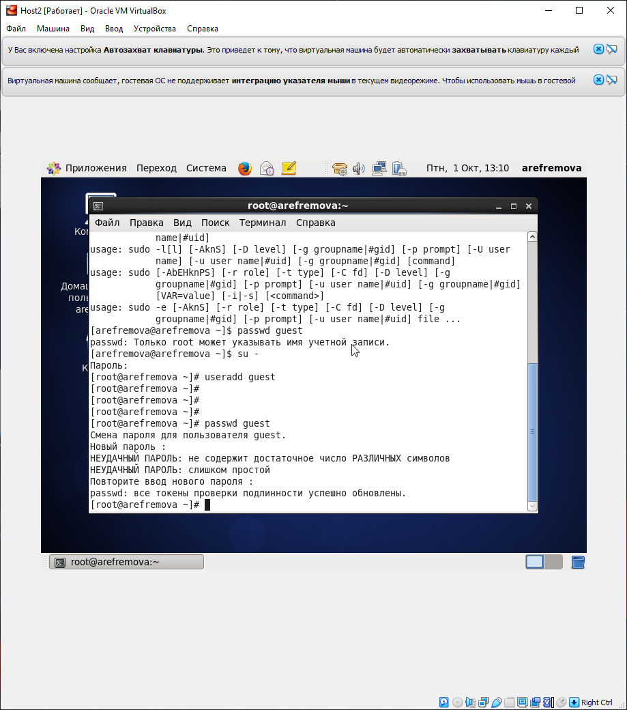
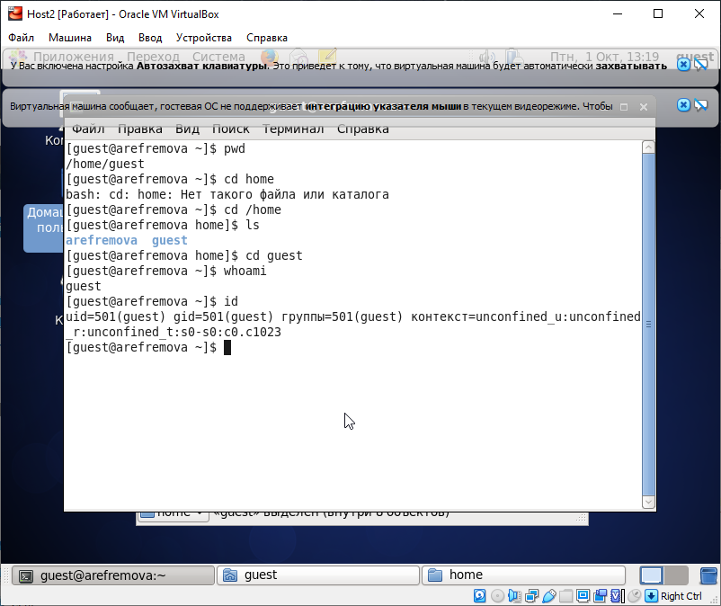
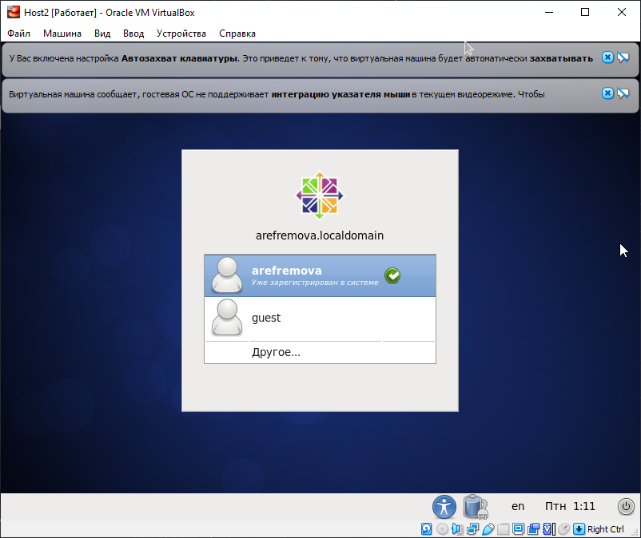

---
## Front matter
lang: ru-RU
title: Лабораторная работа №2
author: |
	Ефремова Ангелина Романовна - студентка группы НКНбд-01-18
date: 01.10.2021

## Formatting
toc: false
slide_level: 2
theme: metropolis
header-includes: 
 - \metroset{progressbar=frametitle,sectionpage=progressbar,numbering=fraction}
 - '\makeatletter'
 - '\beamer@ignorenonframefalse'
 - '\makeatother'
aspectratio: 43
section-titles: true
---

## Тема лабораторной работы

Операции с директориями, файлами и их правами

## Зачем выполнять лабораторную работу?

- В процессе учебы и работы нередки случаи необходимости работы с директориями и файлами. Лабораторная работа обучает всем базовым навыкам работы с директориями и файлами
- Важно знать о том, какие бывают права у файлов и директорий и что происходит в разных комбинациях прав
- Это базовая информационная безопасность!

## Цель выполнения лабораторной работы

Получение практических навыков работы в консоли с атрибутами файлов, закрепление теоретических основ дискреционного разграничения доступа в современных системах с открытым кодом на базе ОС Linux.

## Задачи 

1. Создание учётной записи пользователя guest
2. Выполнение базовых операций с директориями и файлами
3. Заполнение таблицы "Установленные права и разрешённые действия" опытным путем
4. Заполнение таблицы "Минимальные права для совершения операций" на основании заполненной таблицы 

# Краткий процесс выполнения лабораторной работы

## 1 шаг

Создала учётную запись пользователя guest (используя учётную запись администратора) и задала пароль (рис -@fig:001).

{ #fig:001 width=50% }

## 2 шаг

Выполнила базовые операций с директориями и файлами (рис -@fig:002).

{ #fig:002 width=50% }

## 3 шаг

Заполнила таблицу «Установленные права и разрешённые действия» 

## 4 шаг

Заполнила таблицу "Минимальные права для совершения операций" 

# Результаты выполнения лабораторной работы

##

Создана новая учётная запись guest (рис -@fig:003)

{ #fig:003 width=50% }

##

Заполнена таблица «Установленные права и разрешённые действия» 

|Права д-ии|Права ф-ла|Созд. ф-ла|Удал. ф-ла|Зап. в ф-л|Чт. ф-ла|Смена д-ии|Просм. ф-в|Переим. ф-ла|См. атр.|
|----------|----------|----------|----------|----------|--------|----------|----------|------------|--------|
|(000)     |(000)     |-         |-         |-         |-       |-         |-         |-           |-       |
|(100)     |(000)     |-         |-         |-         |-       |+         |-         |-           |+       |
|(200)     |(000)     |-         |-         |-         |-       |-         |-         |-           |-       |
|(300)     |(000)     |+         |+         |-         |-       |+         |-         |+           |+       |
|(400)     |(000)     |-         |-         |-         |-       |-         |+         |-           |-       |
|(500)     |(000)     |-         |-         |-         |-       |+         |+         |-           |+       |
|(600)     |(000)     |-         |-         |-         |-       |-         |+         |-           |-       |
|(700)     |(000)     |+         |+         |-         |-       |+         |+         |+           |+       |
|(100)     |(100)     |-         |-         |-         |-       |+         |-         |-           |+       |
|(300)     |(100)     |+         |+         |-         |-       |+         |-         |+           |+       |

## 

|Права д-ии|Права ф-ла|Созд. ф-ла|Удал. ф-ла|Зап. в ф-л|Чт. ф-ла|Смена д-ии|Просм. ф-в|Переим. ф-ла|См. атр.|
|----------|----------|----------|----------|----------|--------|----------|----------|------------|--------|
|(500)     |(100)     |-         |-         |-         |-       |+         |+         |-           |+       |
|(700)     |(100)     |+         |+         |-         |-       |+         |+         |+           |+       |
|(100)     |(200)     |-         |-         |+         |-       |+         |-         |-           |+       |
|(300)     |(200)     |+         |+         |+         |-       |+         |-         |+           |+       |
|(500)     |(200)     |-         |-         |+         |-       |+         |+         |-           |+       |
|(700)     |(200)     |+         |+         |+         |-       |+         |+         |+           |+       |
|(100)     |(300)     |-         |-         |+         |-       |+         |-         |-           |+       |
|(300)     |(300)     |+         |+         |+         |-       |+         |-         |+           |+       |
|(500)     |(300)     |-         |-         |+         |-       |+         |+         |-           |+       |
|(700)     |(300)     |+         |+         |+         |-       |+         |+         |+           |+       |

##

|Права д-ии|Права ф-ла|Созд. ф-ла|Удал. ф-ла|Зап. в ф-л|Чт. ф-ла|Смена д-ии|Просм. ф-в|Переим. ф-ла|См. атр.|
|----------|----------|----------|----------|----------|--------|----------|----------|------------|--------|
|(100)     |(400)     |-         |-         |-         |+       |+         |-         |-           |+       |
|(300)     |(400)     |+         |+         |-         |+       |+         |-         |+           |+       |
|(500)     |(400)     |-         |-         |-         |+       |+         |+         |-           |+       |
|(700)     |(400)     |+         |+         |-         |+       |+         |+         |+           |+       |
|(100)     |(500)     |-         |-         |-         |+       |+         |-         |-           |+       |
|(300)     |(500)     |+         |+         |-         |+       |+         |-         |+           |+       |
|(500)     |(500)     |-         |-         |-         |+       |+         |+         |-           |+       |
|(700)     |(500)     |+         |+         |-         |+       |+         |+         |+           |+       |
|(100)     |(600)     |-         |-         |+         |+       |+         |-         |-           |+       |
|(300)     |(600)     |+         |+         |+         |+       |+         |-         |+           |+       |

##

|Права д-ии|Права ф-ла|Созд. ф-ла|Удал. ф-ла|Зап. в ф-л|Чт. ф-ла|Смена д-ии|Просм. ф-в|Переим. ф-ла|См. атр.|
|----------|----------|----------|----------|----------|--------|----------|----------|------------|--------|
|(500)     |(600)     |-         |-         |+         |+       |+         |+         |-           |+       |
|(700)     |(600)     |+         |+         |+         |+       |+         |+         |+           |+       |
|(100)     |(700)     |-         |-         |+         |+       |+         |-         |-           |+       |
|(300)     |(700)     |+         |+         |+         |+       |+         |-         |+           |+       |
|(500)     |(700)     |-         |-         |+         |+       |+         |+         |-           |+       |
|(700)     |(700)     |+         |+         |+         |+       |+         |+         |+           |+       |

##

Заполнена таблица "Минимальные права для совершения операций" 

|Операция              |Мин. права на директ.|Мин. права на файл|
|----------------------|---------------------|------------------|
|Создание файла        |d-wx------ (300)     |0                 |
|Удаление файла        |d-wx------ (300)     |0                 |
|Чтение файла          |d--x------ (100)     |-r-------- (400)  |
|Запись в файл         |d--x------ (100)     |--w------- (200)  |
|Переим. файла         |d-wx------ (300)     |0                 |
|Созд. поддиректории   |d-wx------ (300)     |0                 |
|Удал. поддиректории   |d-wx------ (300)     |0                 |

## Выводы

В процессе выполнения лабораторной работы 2 я приобрела практические навыки работы в консоли с атрибутами файлов, закрепление теоретических основ дискреционного разграничения доступа в современных системах с открытым кодом на базе ОС Linux.
