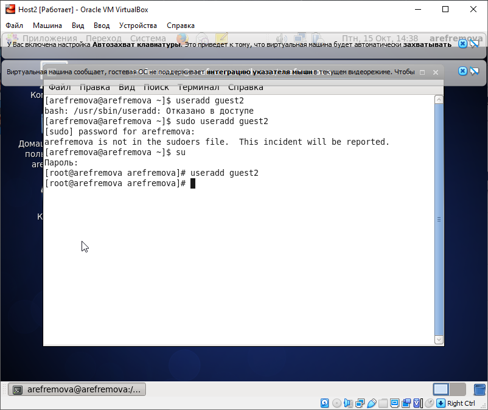
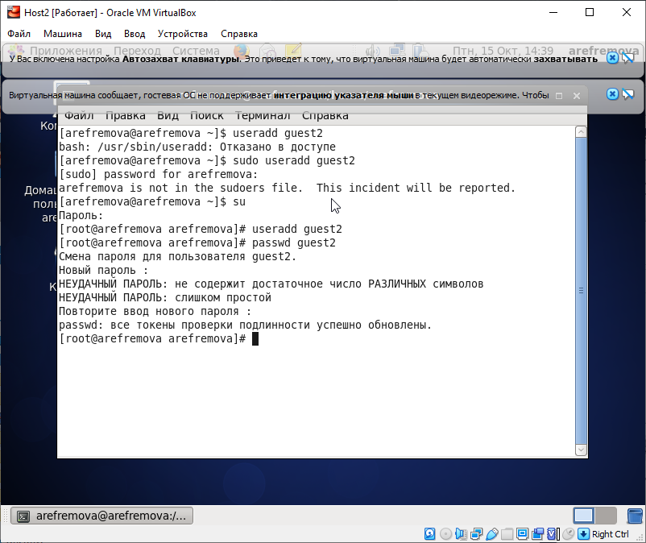
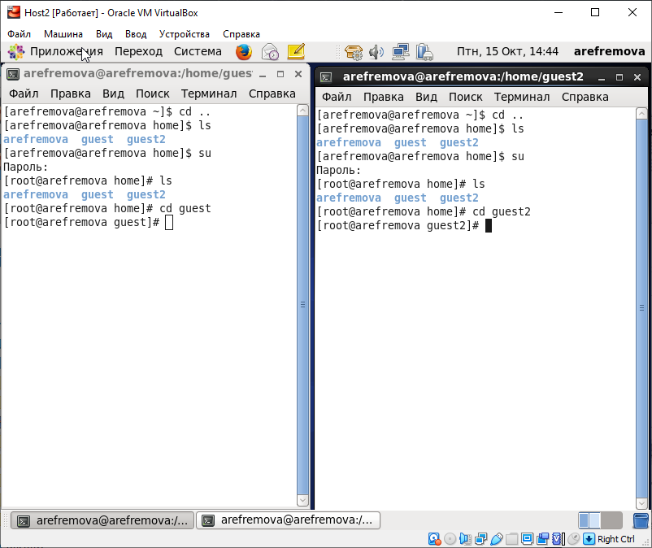
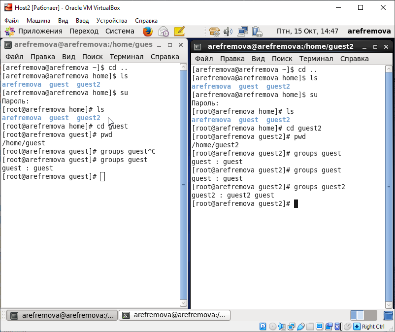
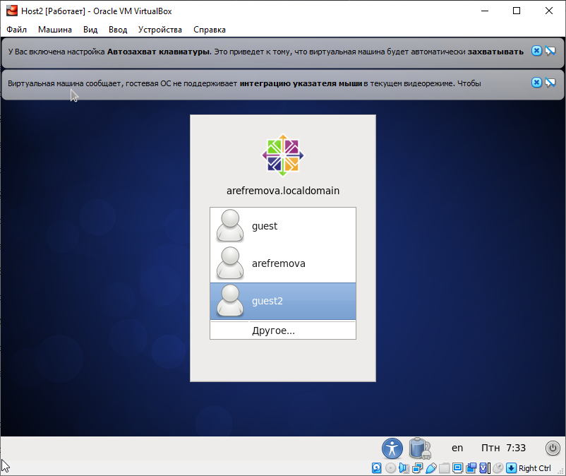

---
## Front matter
lang: ru-RU
title: Лабораторная работа №3
author: |
	Ефремова Ангелина Романовна - студентка группы НКНбд-01-18
date: 15.10.2021

## Formatting
toc: false
slide_level: 2
theme: metropolis
header-includes: 
 - \metroset{progressbar=frametitle,sectionpage=progressbar,numbering=fraction}
 - '\makeatletter'
 - '\beamer@ignorenonframefalse'
 - '\makeatother'
aspectratio: 43
section-titles: true
---

## Тема лабораторной работы

Дискреционное разграничение прав в Linux. Два пользователя

## Зачем выполнять лабораторную работу?

- В процессе учебы и работы нередки случаи необходимости работы с директориями и файлами. Лабораторная работа обучает всем базовым навыкам работы с директориями и файлами
- Важно знать о том, какие бывают права у файлов и директорий и что происходит в разных комбинациях прав
- Необходимо уметь работать с правами нескольких пользователей
- Это базовая информационная безопасность!

## Цель выполнения лабораторной работы

Получение практических навыков работы в консоли с атрибутами файлов для групп пользователей.

## Задачи 

1. Создание учётной записи пользователя guest2
2. Выполнение базовых операций с директориями и файлами
3. Заполнение таблицы "Установленные права и разрешённые действия" опытным путем
4. Заполнение таблицы "Минимальные права для совершения операций" на основании заполненной таблицы 

# Краткий процесс выполнения лабораторной работы

## 1 шаг

Создала учётную запись пользователя guest2 (используя учётную запись администратора) (рис -@fig:001).

{ #fig:001 width=50% }

## 

И задала пароль (рис -@fig:002).

{ #fig:002 width=50% }

## 2 шаг

Добавила пользователя guest2 в группу guest и вошла в систему от двух пользователей (рис -@fig:003).

{ #fig:003 width=50% }

## 2 шаг

Выполнила базовые операций с директориями и файлами (рис -@fig:004).

{ #fig:004 width=50% }

## 3 шаг

Заполнила таблицу «Установленные права и разрешённые действия» 

## 4 шаг

Заполнила таблицу "Минимальные права для совершения операций" 

# Результаты выполнения лабораторной работы

##

Создана новая учётная запись guest2 (рис -@fig:005)

{ #fig:005 width=50% }

##

Заполнена таблица «Установленные права и разрешённые действия» 

|Права д-ии|Права ф-ла|Созд. ф-ла|Удал. ф-ла|Зап. в ф-л|Чт. ф-ла|Смена д-ии|Просм. ф-в|Переим. ф-ла|См. атр.|
|----------|----------|----------|----------|----------|--------|----------|----------|------------|--------|
|(000)     |(000)     |-         |-         |-         |-       |-         |-         |-           |-       |
|(000)     |(010)     |-         |-         |-         |-       |-         |-         |-           |-       |
|(000)     |(020)     |-         |-         |-         |-       |-         |-         |-           |-       |
|(000)     |(030)     |-         |-         |-         |-       |-         |-         |-           |-       |
|(000)     |(040)     |-         |-         |-         |-       |-         |-         |-           |-       |
|(000)     |(050)     |-         |-         |-         |-       |-         |-         |-           |-       |
|(000)     |(060)     |-         |-         |-         |-       |-         |-         |-           |-       |
|(000)     |(070)     |-         |-         |-         |-       |-         |-         |-           |-       |

## 

|Права д-ии|Права ф-ла|Созд. ф-ла|Удал. ф-ла|Зап. в ф-л|Чт. ф-ла|Смена д-ии|Просм. ф-в|Переим. ф-ла|См. атр.|
|----------|----------|----------|----------|----------|--------|----------|----------|------------|--------|
|(010)     |(000)     |-         |-         |-         |-       |+         |-         |-           |+       |
|(010)     |(010)     |-         |-         |-         |-       |+         |-         |-           |+       |
|(010)     |(020)     |-         |-         |+         |-       |+         |-         |-           |+       |
|(010)     |(030)     |-         |-         |+         |-       |+         |-         |-           |+       |
|(010)     |(040)     |-         |-         |-         |+       |+         |-         |-           |+       |
|(010)     |(050)     |-         |-         |-         |+       |+         |-         |-           |+       |
|(010)     |(060)     |-         |-         |+         |+       |+         |-         |-           |+       |
|(010)     |(070)     |-         |-         |+         |+       |+         |-         |-           |+       |

##

|Права д-ии|Права ф-ла|Созд. ф-ла|Удал. ф-ла|Зап. в ф-л|Чт. ф-ла|Смена д-ии|Просм. ф-в|Переим. ф-ла|См. атр.|
|----------|----------|----------|----------|----------|--------|----------|----------|------------|--------|
|(020)     |(000)     |-         |-         |-         |-       |-         |-         |-           |-       |
|(020)     |(010)     |-         |-         |-         |-       |-         |-         |-           |-       |
|(020)     |(020)     |-         |-         |-         |-       |-         |-         |-           |-       |
|(020)     |(030)     |-         |-         |-         |-       |-         |-         |-           |-       |
|(020)     |(040)     |-         |-         |-         |-       |-         |-         |-           |-       |
|(020)     |(050)     |-         |-         |-         |-       |-         |-         |-           |-       |
|(020)     |(060)     |-         |-         |-         |-       |-         |-         |-           |-       |
|(020)     |(070)     |-         |-         |-         |-       |-         |-         |-           |-       |

##

|Права д-ии|Права ф-ла|Созд. ф-ла|Удал. ф-ла|Зап. в ф-л|Чт. ф-ла|Смена д-ии|Просм. ф-в|Переим. ф-ла|См. атр.|
|----------|----------|----------|----------|----------|--------|----------|----------|------------|--------|
|(030)     |(000)     |+         |+         |-         |-       |+         |-         |+           |+       |
|(030)     |(010)     |+         |+         |-         |-       |+         |-         |+           |+       |
|(030)     |(020)     |+         |+         |+         |-       |+         |-         |+           |+       |
|(030)     |(030)     |+         |+         |+         |-       |+         |-         |+           |+       |
|(030)     |(040)     |+         |+         |-         |+       |+         |-         |+           |+       |
|(030)     |(050)     |+         |+         |-         |+       |+         |-         |+           |+       |
|(030)     |(060)     |+         |+         |+         |+       |+         |-         |+           |+       |
|(030)     |(070)     |+         |+         |+         |+       |+         |-         |+           |+       |

##

|Права д-ии|Права ф-ла|Созд. ф-ла|Удал. ф-ла|Зап. в ф-л|Чт. ф-ла|Смена д-ии|Просм. ф-в|Переим. ф-ла|См. атр.|
|----------|----------|----------|----------|----------|--------|----------|----------|------------|--------|
|(040)     |(000)     |-         |-         |-         |-        |-         |+         |-           |-       |
|(040)     |(010)     |-         |-         |-         |-        |-         |+         |-           |-       |
|(040)     |(020)     |-         |-         |-         |-        |-         |+         |-           |-       |
|(040)     |(030)     |-         |-         |-         |-        |-         |+         |-           |-       |
|(040)     |(040)     |-         |-         |-         |-        |-         |+         |-           |-       |
|(040)     |(050)     |-         |-         |-         |-        |-         |+         |-           |-       |
|(040)     |(060)     |-         |-         |-         |-        |-         |+         |-           |-       |
|(040)     |(070)     |-         |-         |-         |-        |-         |+         |-           |-       |

## 

|Права д-ии|Права ф-ла|Созд. ф-ла|Удал. ф-ла|Зап. в ф-л|Чт. ф-ла|Смена д-ии|Просм. ф-в|Переим. ф-ла|См. атр.|
|----------|----------|----------|----------|----------|--------|----------|----------|------------|--------|
|(050)     |(000)     |-         |-         |-         |-       |+         |+         |-           |+       |
|(050)     |(010)     |-         |-         |-         |-       |+         |+         |-           |+       |
|(050)     |(020)     |-         |-         |+         |-       |+         |+         |-           |+       |
|(050)     |(030)     |-         |-         |+         |-       |+         |+         |-           |+       |
|(050)     |(040)     |-         |-         |-         |+       |+         |+         |-           |+       |
|(050)     |(050)     |-         |-         |-         |+       |+         |+         |-           |+       |
|(050)     |(060)     |-         |-         |+         |+       |+         |+         |-           |+       |
|(050)     |(070)     |-         |-         |+         |+       |+         |+         |-           |+       |

## 

|Права д-ии|Права ф-ла|Созд. ф-ла|Удал. ф-ла|Зап. в ф-л|Чт. ф-ла|Смена д-ии|Просм. ф-в|Переим. ф-ла|См. атр.|
|----------|----------|----------|----------|----------|--------|----------|----------|------------|--------|
|(060)     |(000)     |-         |-         |-         |-       |-         |+         |-           |-       |
|(060)     |(010)     |-         |-         |-         |-       |-         |+         |-           |-       |
|(060)     |(020)     |-         |-         |-         |-       |-         |+         |-           |-       |
|(060)     |(030)     |-         |-         |-         |-       |-         |+         |-           |-       |
|(060)     |(040)     |-         |-         |-         |-       |-         |+         |-           |-       |
|(060)     |(050)     |-         |-         |-         |-       |-         |+         |-           |-       |
|(060)     |(060)     |-         |-         |-         |-       |-         |+         |-           |-       |
|(060)     |(070)     |-         |-         |-         |-       |-         |+         |-           |-       |

## 

|Права д-ии|Права ф-ла|Созд. ф-ла|Удал. ф-ла|Зап. в ф-л|Чт. ф-ла|Смена д-ии|Просм. ф-в|Переим. ф-ла|См. атр.|
|----------|----------|----------|----------|----------|--------|----------|----------|------------|--------|
|(070)     |(000)     |+         |+         |-         |-       |+         |+         |+           |+       |
|(070)     |(010)     |+         |+         |-         |-       |+         |+         |+           |+       |
|(070)     |(020)     |+         |+         |+         |-       |+         |+         |+           |+       |
|(070)     |(030)     |+         |+         |+         |-       |+         |+         |+           |+       |
|(070)     |(040)     |+         |+         |-         |+       |+         |+         |+           |+       |
|(070)     |(050)     |+         |+         |-         |+       |+         |+         |+           |+       |
|(070)     |(060)     |+         |+         |+         |+       |+         |+         |+           |+       |
|(070)     |(070)     |+         |+         |+         |+       |+         |+         |+           |+       |

## 

Заполнена таблица "Минимальные права для совершения операций" 

|Операция              |Мин. права на директ.|Мин. права на файл|
|----------------------|---------------------|------------------|
|Создание файла        |(030)                |(000)             |
|Удаление файла        |(030)                |(000)             |
|Чтение файла          |(010)                |(040)             |
|Запись в файл         |(010)                |(020)             |
|Переименование файла  |(030)                |(000)             |
|Создание поддирект.   |(030)                |(000)             |
|Удаление поддирект.   |(030)                |(000)             |

## Выводы

В процессе выполнения лабораторной работы 3 я приобрела практические навыки работы в консоли с атрибутами файлов для групп пользователей.
