---
# Front matter
lang: ru-RU
title: "Лабораторная работа №3"
subtitle: "Дискреционное разграничение прав в Linux. Два пользователя"
author: "Ефремова Ангелина Романовна"

# Formatting
toc-title: "Содержание"
toc: true # Table of contents
toc_depth: 2
lof: true # List of figures
lot: true # List of tables
fontsize: 12pt
linestretch: 1.5
papersize: a4paper
documentclass: scrreprt
polyglossia-lang: russian
polyglossia-otherlangs: english
mainfont: PT Serif
romanfont: PT Serif
sansfont: PT Sans
monofont: PT Mono
mainfontoptions: Ligatures=TeX
romanfontoptions: Ligatures=TeX
sansfontoptions: Ligatures=TeX,Scale=MatchLowercase
monofontoptions: Scale=MatchLowercase
indent: true
pdf-engine: lualatex
header-includes:
  - \linepenalty=10 # the penalty added to the badness of each line within a paragraph (no associated penalty node) Increasing the value makes tex try to have fewer lines in the paragraph.
  - \interlinepenalty=0 # value of the penalty (node) added after each line of a paragraph.
  - \hyphenpenalty=50 # the penalty for line breaking at an automatically inserted hyphen
  - \exhyphenpenalty=50 # the penalty for line breaking at an explicit hyphen
  - \binoppenalty=700 # the penalty for breaking a line at a binary operator
  - \relpenalty=500 # the penalty for breaking a line at a relation
  - \clubpenalty=150 # extra penalty for breaking after first line of a paragraph
  - \widowpenalty=150 # extra penalty for breaking before last line of a paragraph
  - \displaywidowpenalty=50 # extra penalty for breaking before last line before a display math
  - \brokenpenalty=100 # extra penalty for page breaking after a hyphenated line
  - \predisplaypenalty=10000 # penalty for breaking before a display
  - \postdisplaypenalty=0 # penalty for breaking after a display
  - \floatingpenalty = 20000 # penalty for splitting an insertion (can only be split footnote in standard LaTeX)
  - \raggedbottom # or \flushbottom
  - \usepackage{float} # keep figures where there are in the text
  - \floatplacement{figure}{H} # keep figures where there are in the text
---

# Цель работы

Получение практических навыков работы в консоли с атрибутами файлов для групп пользователей.

# Задание

1. Создание учётной записи пользователя guest2
2. Выполнение базовых операций с директориями и файлами
3. Заполнение таблицы "Установленные права и разрешённые действия" опытным путем
4. Заполнение таблицы "Минимальные права для совершения операций" на основании заполненной таблицы 

# Выполнение лабораторной работы

1. В установленной при выполнении предыдущей лабораторной работы операционной системе создала учётную запись пользователя guest2 (используя учётную запись администратора): useradd guest2 (рис -@fig:001).

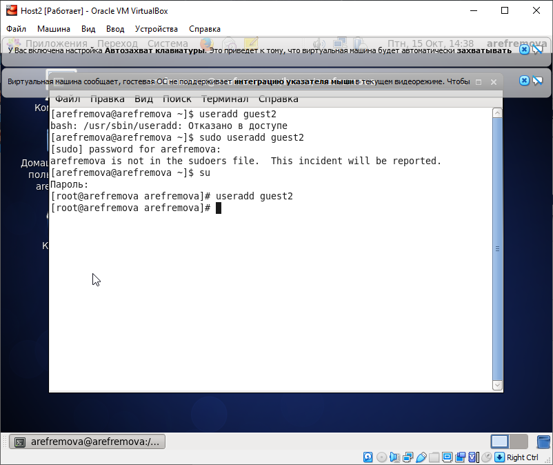{ #fig:001 width=70% }

Задала пароль для пользователя guest2 (используя учётную запись администратора): passwd guest2 (рис -@fig:002).

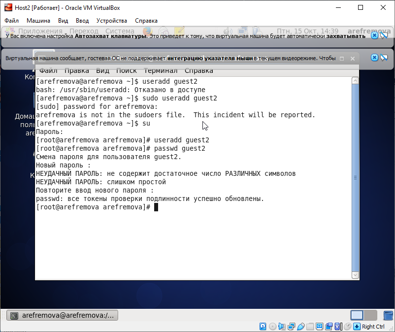{ #fig:002 width=70% }

2. Добавила пользователя guest2 в группу guest: gpasswd -a guest2 guest (рис -@fig:003).

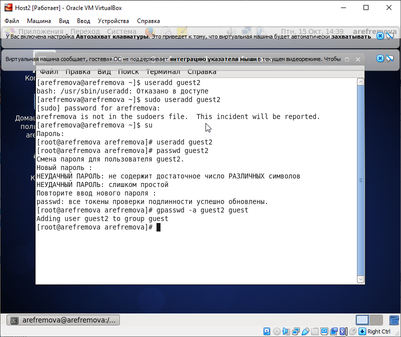{ #fig:003 width=70% }

Осуществила вход в систему от двух пользователей на двух разных консолях: guest на первой консоли и guest2 на второй консоли.

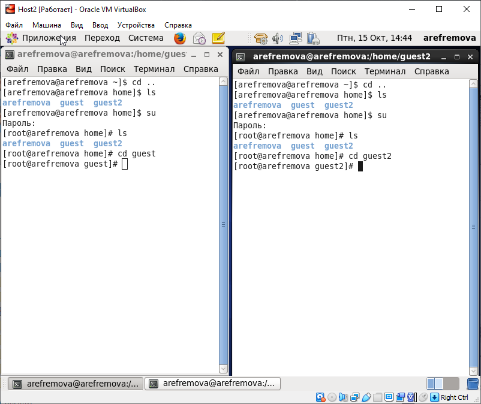{ #fig:004 width=70% }

Для обоих пользователей командой pwd определила директорию, в которой я нахожусь (рис -@fig:005).

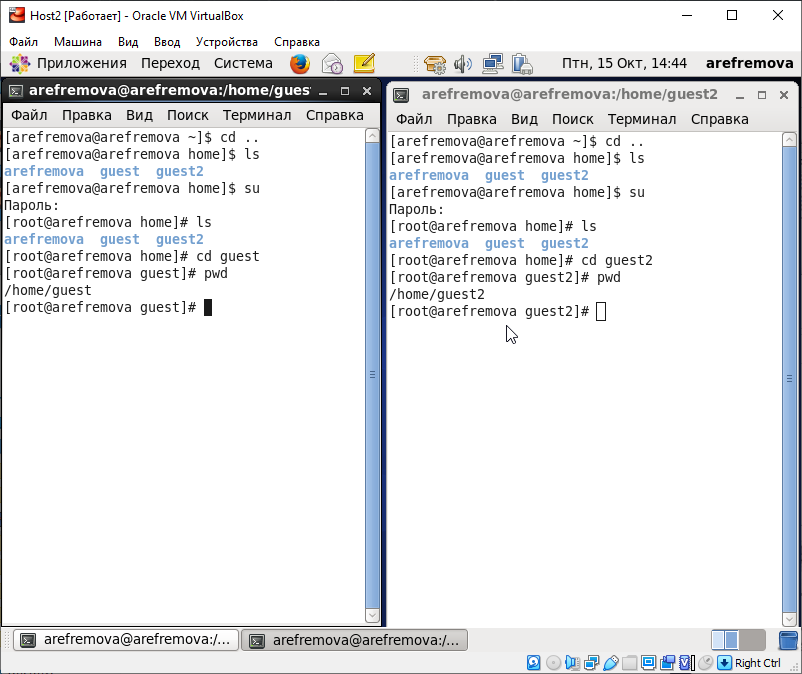{ #fig:005 width=70% }

Уточнила имя моего пользователя, его группу, кто входит в неё и к каким группам принадлежит он сам. Определила командами groups guest и groups guest2, в какие группы входят пользователи guest и guest2 (рис -@fig:006). groups и id -Gn и id -G выдают похожие вещи (рис -@fig:007). 

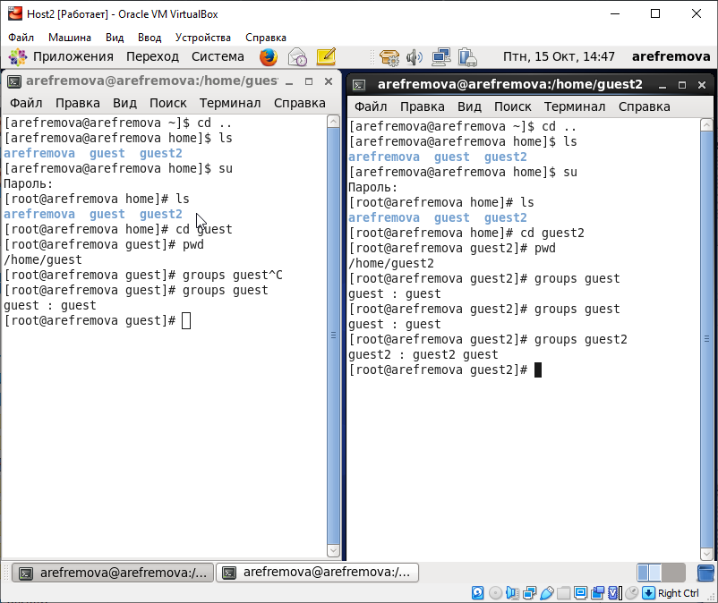{ #fig:006 width=70% }

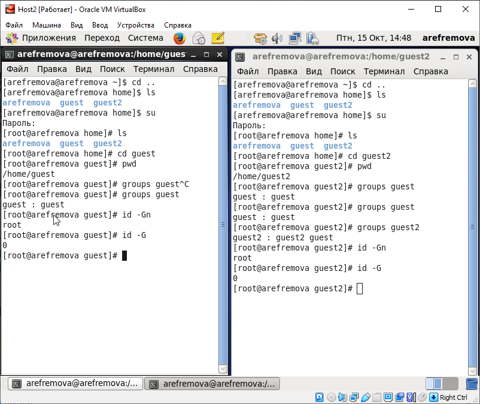{ #fig:007 width=70% }

Просмотрела файл /etc/passwd командой cat /etc/passwd. Нашла в нём свою учётную запись. Определила uid пользователя. Определила gid пользователя. Сравнила найденные значения с полученными в предыдущих пунктах. Все сходится (рис -@fig:008).

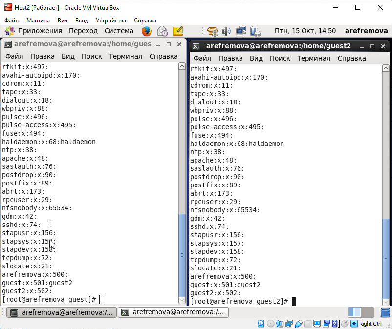{ #fig:008 width=70% }

От имени пользователя guest2 выполнила регистрацию пользователя guest2 в группе guest командой newgrp guest (рис -@fig:009).

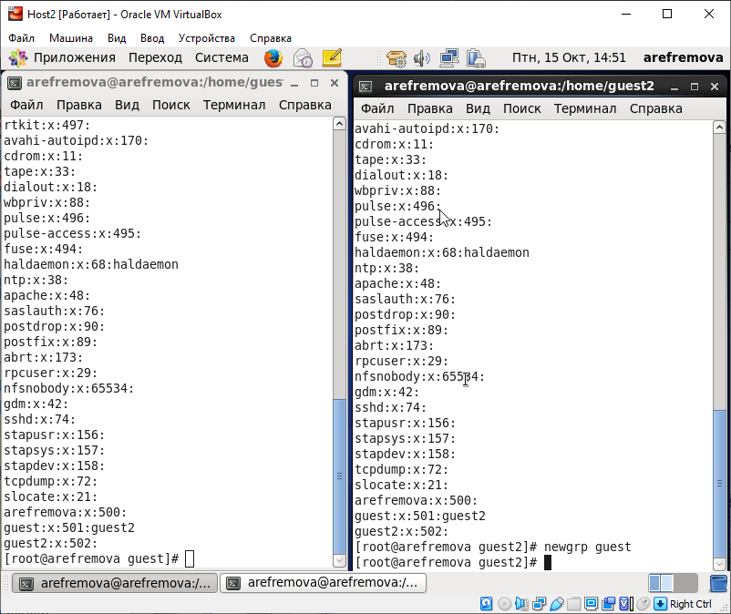{ #fig:009 width=70% }

От имени пользователя guest изменила права директории /home/guest, разрешив все действия для пользователей группы: chmod g+rwx /home/guest (рис -@fig:010).

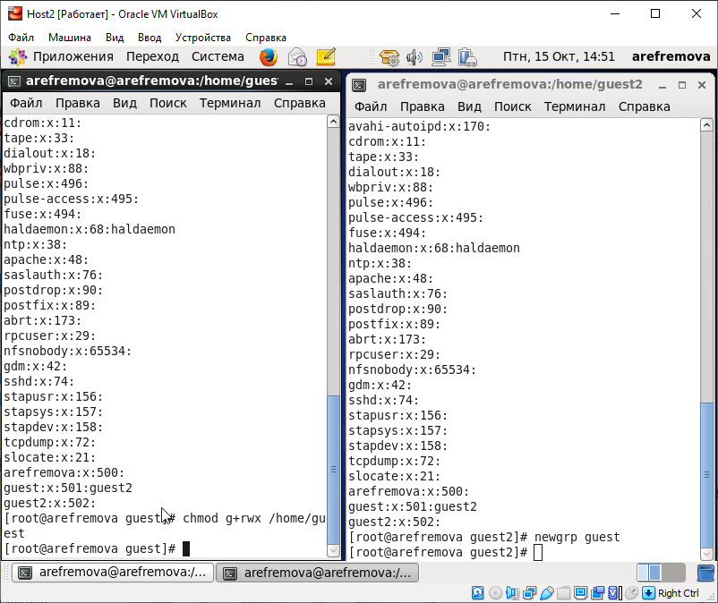{ #fig:010 width=70% }

От имени пользователя guest сняла с директории /home/guest/dir1 все атрибуты командой chmod 000 dirl (рис -@fig:011).

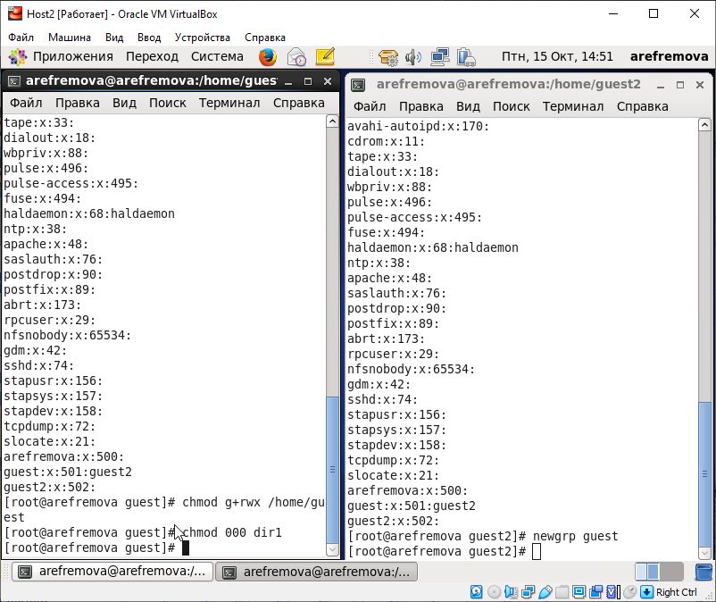{ #fig:011 width=70% }

Проверила, какие расширенные атрибуты установлены на dir1 командой: lsattr /home. Мне удалось увидеть расширенные атрибуты директории (рис -@fig:012).

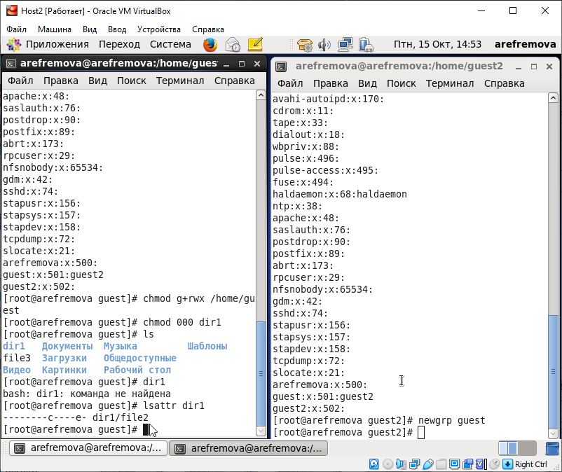{ #fig:012 width=70% }

3. Заполнила таблицу «Установленные права и разрешённые действия», выполняя действия от имени владельца директории (файлов), определив опытным путём, какие операции разрешены, а какие нет.
Если операция разрешена, занесила в таблицу знак «+», если не разрешена, знак «-».

Я не буду объяснять все операции, так как все они аналогичны и были разобраны выше, меняются только права папок и файлов. Кратко о моих действиях : (рис -@fig:013), (рис -@fig:014).

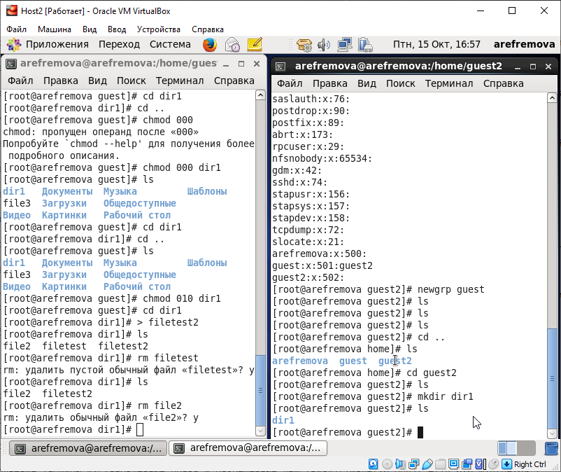{ #fig:013 width=70% }

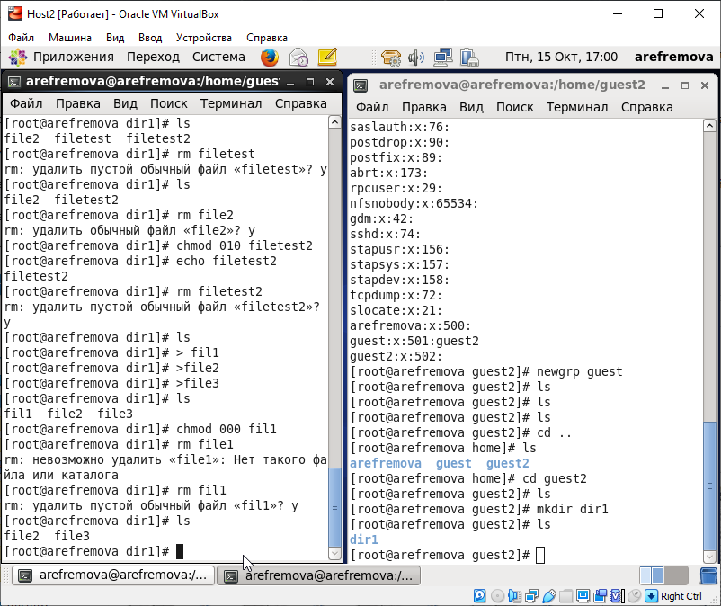{ #fig:014 width=70% }

И сама таблица (таб. 3.1):

|Права д-ии|Права ф-ла|Созд. ф-ла|Удал. ф-ла|Зап. в ф-л|Чт. ф-ла|Смена д-ии|Просм. ф-в|Переим. ф-ла|См. атр.|
|----------|----------|----------|----------|----------|--------|----------|----------|------------|--------|
|(000)     |(000)     |-         |-         |-         |-       |-         |-         |-           |-       |
|(000)     |(010)     |-         |-         |-         |-       |-         |-         |-           |-       |
|(000)     |(020)     |-         |-         |-         |-       |-         |-         |-           |-       |
|(000)     |(030)     |-         |-         |-         |-       |-         |-         |-           |-       |
|(000)     |(040)     |-         |-         |-         |-       |-         |-         |-           |-       |
|(000)     |(050)     |-         |-         |-         |-       |-         |-         |-           |-       |
|(000)     |(060)     |-         |-         |-         |-       |-         |-         |-           |-       |
|(000)     |(070)     |-         |-         |-         |-       |-         |-         |-           |-       |
|(010)     |(000)     |-         |-         |-         |-       |+         |-         |-           |+       |
|(010)     |(010)     |-         |-         |-         |-       |+         |-         |-           |+       |
|(010)     |(020)     |-         |-         |+         |-       |+         |-         |-           |+       |
|(010)     |(030)     |-         |-         |+         |-       |+         |-         |-           |+       |
|(010)     |(040)     |-         |-         |-         |+       |+         |-         |-           |+       |
|(010)     |(050)     |-         |-         |-         |+       |+         |-         |-           |+       |
|(010)     |(060)     |-         |-         |+         |+       |+         |-         |-           |+       |
|(010)     |(070)     |-         |-         |+         |+       |+         |-         |-           |+       |
|(020)     |(000)     |-         |-         |-         |-       |-         |-         |-           |-       |
|(020)     |(010)     |-         |-         |-         |-       |-         |-         |-           |-       |
|(020)     |(020)     |-         |-         |-         |-       |-         |-         |-           |-       |
|(020)     |(030)     |-         |-         |-         |-       |-         |-         |-           |-       |
|(020)     |(040)     |-         |-         |-         |-       |-         |-         |-           |-       |
|(020)     |(050)     |-         |-         |-         |-       |-         |-         |-           |-       |
|(020)     |(060)     |-         |-         |-         |-       |-         |-         |-           |-       |
|(020)     |(070)     |-         |-         |-         |-       |-         |-         |-           |-       |
|(030)     |(000)     |+         |+         |-         |-       |+         |-         |+           |+       |
|(030)     |(010)     |+         |+         |-         |-       |+         |-         |+           |+       |
|(030)     |(020)     |+         |+         |+         |-       |+         |-         |+           |+       |
|(030)     |(030)     |+         |+         |+         |-       |+         |-         |+           |+       |
|(030)     |(040)     |+         |+         |-         |+       |+         |-         |+           |+       |
|(030)     |(050)     |+         |+         |-         |+       |+         |-         |+           |+       |
|(030)     |(060)     |+         |+         |+         |+       |+         |-         |+           |+       |
|(030)     |(070)     |+         |+         |+         |+       |+         |-         |+           |+       |
|(040)     |(000)     |-         |-         |-         |-        |-         |+         |-           |-       |
|(040)     |(010)     |-         |-         |-         |-        |-         |+         |-           |-       |
|(040)     |(020)     |-         |-         |-         |-        |-         |+         |-           |-       |
|(040)     |(030)     |-         |-         |-         |-        |-         |+         |-           |-       |
|(040)     |(040)     |-         |-         |-         |-        |-         |+         |-           |-       |
|(040)     |(050)     |-         |-         |-         |-        |-         |+         |-           |-       |
|(040)     |(060)     |-         |-         |-         |-        |-         |+         |-           |-       |
|(040)     |(070)     |-         |-         |-         |-        |-         |+         |-           |-       |
|(050)     |(000)     |-         |-         |-         |-       |+         |+         |-           |+       |
|(050)     |(010)     |-         |-         |-         |-       |+         |+         |-           |+       |
|(050)     |(020)     |-         |-         |+         |-       |+         |+         |-           |+       |
|(050)     |(030)     |-         |-         |+         |-       |+         |+         |-           |+       |
|(050)     |(040)     |-         |-         |-         |+       |+         |+         |-           |+       |
|(050)     |(050)     |-         |-         |-         |+       |+         |+         |-           |+       |
|(050)     |(060)     |-         |-         |+         |+       |+         |+         |-           |+       |
|(050)     |(070)     |-         |-         |+         |+       |+         |+         |-           |+       |
|(060)     |(000)     |-         |-         |-         |-       |-         |+         |-           |-       |
|(060)     |(010)     |-         |-         |-         |-       |-         |+         |-           |-       |
|(060)     |(020)     |-         |-         |-         |-       |-         |+         |-           |-       |
|(060)     |(030)     |-         |-         |-         |-       |-         |+         |-           |-       |
|(060)     |(040)     |-         |-         |-         |-       |-         |+         |-           |-       |
|(060)     |(050)     |-         |-         |-         |-       |-         |+         |-           |-       |
|(060)     |(060)     |-         |-         |-         |-       |-         |+         |-           |-       |
|(060)     |(070)     |-         |-         |-         |-       |-         |+         |-           |-       |
|(070)     |(000)     |+         |+         |-         |-       |+         |+         |+           |+       |
|(070)     |(010)     |+         |+         |-         |-       |+         |+         |+           |+       |
|(070)     |(020)     |+         |+         |+         |-       |+         |+         |+           |+       |
|(070)     |(030)     |+         |+         |+         |-       |+         |+         |+           |+       |
|(070)     |(040)     |+         |+         |-         |+       |+         |+         |+           |+       |
|(070)     |(050)     |+         |+         |-         |+       |+         |+         |+           |+       |
|(070)     |(060)     |+         |+         |+         |+       |+         |+         |+           |+       |
|(070)     |(070)     |+         |+         |+         |+       |+         |+         |+           |+       |

Таблица 3.1: Установленные права и разрешённые действия

4. На основании заполненной таблицы определила те или иные минимально необходимые права для выполнения операций внутри директории
dir1, заполнила таблицу "Минимальные права для совершения операций" (таб. 4.1).

|Операция              |Мин. права на директорию|Мин. права на файл|
|----------------------|------------------------|------------------|
|Создание файла        |(030)                   |(000)             |
|Удаление файла        |(030)                   |(000)             |
|Чтение файла          |(010)                   |(040)             |
|Запись в файл         |(010)                   |(020)             |
|Переименование файла  |(030)                   |(000)             |
|Создание поддиректории|(030)                   |(000)             |
|Удаление поддиректории|(030)                   |(000)             |

Таблица 4.1: Минимальные права для совершения операций
                

# Выводы

В процессе выполнения лабораторной работы 3 я приобрела практические навыки работы в консоли с атрибутами файлов для групп пользователей.
